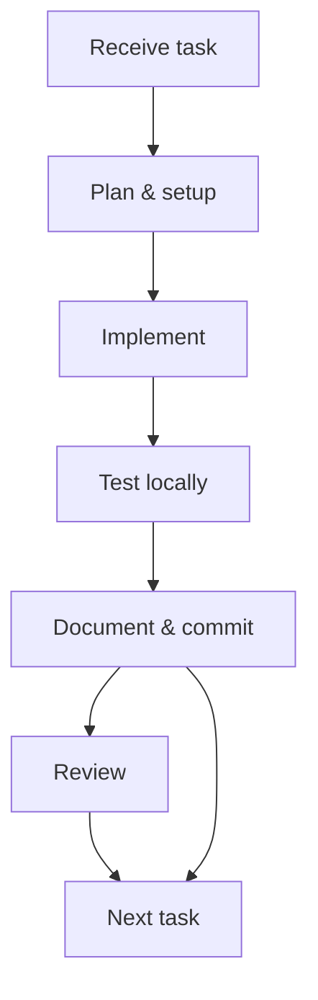

# Internship — MERN Stack Daily Practice

This repository contains my daily internship tasks and practice assignments given by Ma'am. The internship runs from 1 June to 31 August. Each day folder corresponds to a day's tasks (for example, Day 1 is `06-01_June_Day1`).

## Purpose

- Track daily tasks assigned during the internship.
- Record what I completed each day and what I learned.

## Repository structure

- `06-01_June_Day1/`, `06-02_June_Day2/`, `06-03_June_Day3/`, `06-04_June_Day4/`, ... — daily folders containing HTML, JS, images, and task files for that day.
- See the root folders for the exact files (e.g. `06-01_June_Day1/basic.js`, `06-02_June_Day2/variable.js`).

## Day-wise Summary (Concise)

Below is a concise daily focus overview for each internship day (1 June — 31 August). For days already in this repo, file references are shown.

|        Date | Folder           |
| ----------: | :--------------- |
|  1 Jun 2026 | 06-01_June_Day1  |
|  2 Jun 2026 | 06-02_June_Day2  |
|  3 Jun 2026 | 06-03_June_Day3  |
|  4 Jun 2026 | 06-04_June_Day4  |
|  5 Jun 2026 | 06-05_June_Day5  |
|  6 Jun 2026 | 06-06_June_Day6  |
|  7 Jun 2026 | 06-07_June_Day7  |
|  8 Jun 2026 | 06-08_June_Day8  |
|  9 Jun 2026 | 06-09_June_Day9  |
| 10 Jun 2026 | 06-10_June_Day10 |
| 11 Jun 2026 | 06-11_June_Day11 |
| 12 Jun 2026 | 06-12_June_Day12 |
| 13 Jun 2026 | 06-13_June_Day13 |
| 15 Jun 2026 | 06-15_June_Day15 |
| 17 Jun 2026 | 06-17_June_Day17 |
| 18 Jun 2026 | 06-18_June_Day18 |
| 19 Jun 2026 | 06-19_June_Day19 |
| 20 Jun 2026 | 06-20_June_Day20 |
| 22 Jun 2026 | 06-22_June_Day22 |
| 23 Jun 2026 | 06-23_June_Day23 |
| 24 Jun 2026 | 06-24_June_Day24 |
| 27 Jun 2026 | 06-27_June_Day27 |
| 28 Jun 2026 | 06-28_June_Day28 |
| 29 Jun 2026 | 06-29_June_Day29 |
| 30 Jun 2026 | 06-30_June_Day30 |
|  1 Jul 2026 | 07-1_July_Day31  |

<!-- Compact placeholders for remaining days: brief entries removed as requested -->

**Status:** Day 31 Task Completed (1 July 2026) — see the `07-1_July_Day31/` folder for files and examples.
