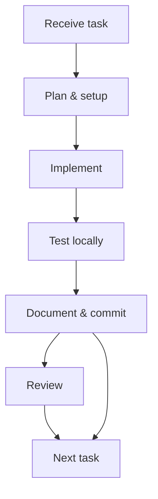

# Internship — MERN Stack Daily Practice

This repository contains my daily internship tasks and practice assignments given by Ma'am. The internship runs from 1 June to 31 August. Each "DayN" folder corresponds to a day's tasks (Day 1 = 1 June, Day 2 = 2 June, etc.).

## Purpose

- Track daily tasks assigned during the internship.
- Record what I completed each day and what I learned.

## Repository structure

- `01-June_Day1/`, `02-June_Day2/`, `03-June_Day3/`, `04-June_Day4/`, ... — daily folders containing HTML, JS, images, and task files for that day.
- See the root folders for the exact files (e.g. `01-June_Day1/basic.js`, `02-June_Day2/variable.js`).

## Day-wise Summary (Concise)

Below is a concise daily focus overview for each internship day (1 June — 31 August). For days already in this repo, file references are shown.

|       Date | Folder       |
| ---------: | :----------- |
| 1 Jun 2026 | 01-June_Day1 |
| 2 Jun 2026 | 02-June_Day2 |
| 3 Jun 2026 | 03-June_Day3 |
| 4 Jun 2026 | 04-June_Day4 |
| 5 Jun 2026 | 05-June_Day5 |
| 6 Jun 2026 | 06-June_Day6 |
| 7 Jun 2026 | 07-June_Day7 |
| 8 Jun 2026 | 08-June_Day8 |
| 9 Jun 2026 | 09-June_Day9 |

<!-- Compact placeholders for remaining days: brief entries removed as requested -->

**Status:** Day 9 Task Completed (09 June 2026) — see the `09-June_Day9/` folder for files and examples.
