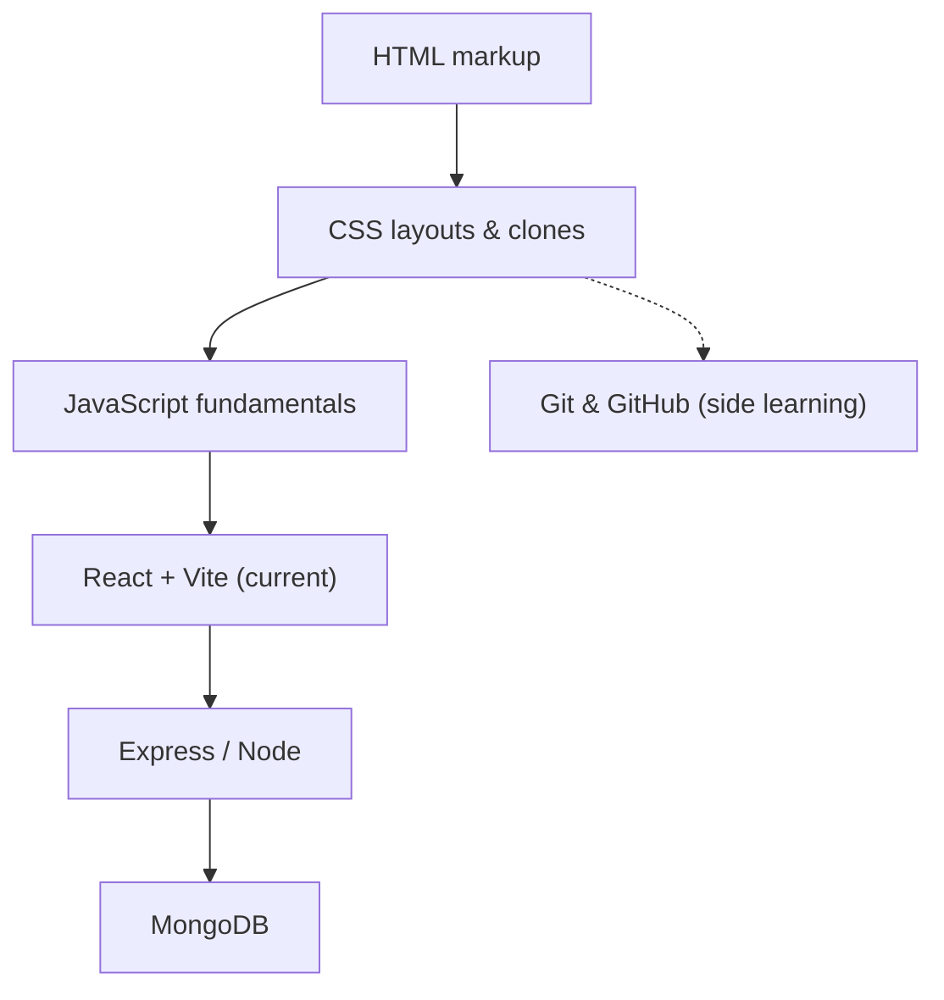

# Internship — MERN Stack Daily Practice

Daily internship tasks and practice assignments in the **MERN stack**
(MongoDB · Express · React · Node.js). The internship runs from
**1 June 2026 → 31 August 2026**. Each day's work lives in its own folder,
named `MM-DD_Month_DayN` (e.g. `06-01_June_Day1`, `07-01_July_Day31`).

**Progress:** Day 32 reached · currently in the **React** phase.

## Learning path

The daily tasks follow a build-up from raw web fundamentals toward the
full MERN stack. The arrows show the roadmap; the highlighted node is
where this repo currently sits.



## Repository structure

- **Day folders** — `06-01_June_Day1/`, `06-02_June_Day2/`, …,
  `07-04_July_Day32/` — one per working day. Each holds the day's HTML,
  JS, images, or project files.
- Some calendar days have **no folder** (Days 14, 16, 21, 25, 26) —
  weekend / rest days, so nothing was committed those dates.
- The most recent folder, `07-04_July_Day32/`, contains a **CSS Grid**
  layout (`grid.html`).
- React projects (`07-01_July_Day31/`) were the first Vite + React 19
  work.

## Day-wise summary

| Folder               | Focus                                   | Key files                                            |
| -------------------- | --------------------------------------- | ---------------------------------------------------- |
| `06-01_June_Day1`  | HTML & JS basics; IPL team page         | `basic.js`, `index.html`, `Task1.html`         |
| `06-02_June_Day2`  | JS variables; bill & login pages        | `variable.js`, `Bill.html`, `Login.html`       |
| `06-03_June_Day3`  | HTML markup drills (×5)                | `Task1`–`Task5.html`                            |
| `06-04_June_Day4`  | HTML markup drills (×3)                | `Task1`–`Task3.html`                            |
| `06-05_June_Day5`  | 20 HTML mini-tasks                      | `task1`–`task20.html`                           |
| `06-06_June_Day6`  | HTML lists & tables                     | `List-Task1/2.html`, `Table-Task3.html`          |
| `06-07_June_Day7`  | Web page & generic task                 | `task.html`, `web.html`                          |
| `06-08_June_Day8`  | JS loops; login & time                  | `loop.js`, `login.html`, `Time.html`           |
| `06-09_June_Day9`  | JS number / star patterns               | `Pattern1`–`Pattern10.js`                       |
| `06-10_June_Day10` | Git fundamentals (cheat sheet)          | `git-cheat-sheet-education.pdf`                    |
| `06-11_June_Day11` | Amazon Lite (clone)                     | `AmazonLite.html`                                  |
| `06-12_June_Day12` | DevOps homework                         | `devops-homework-01/`                              |
| `06-13_June_Day13` | CSS layouts: Flipkart, profile, shapes  | `flipkart.html`, `Profile.html`, `shapes.html` |
| `06-15_June_Day15` | JS arrays; Todo app                     | `array.js`, `task.js`, `Todo.html`             |
| `06-17_June_Day17` | JS objects; product page                | `obj.js`, `Product.html`                         |
| `06-18_June_Day18` | Instagram (clone)                       | `insta.html`                                       |
| `06-19_June_Day19` | Forms                                   | `Form.html`                                        |
| `06-20_June_Day20` | Netflix (clone)                         | `netflix.html`                                     |
| `06-22_June_Day22` | Login form (CSS)                        | `login.html`                                       |
| `06-23_June_Day23` | Search & text components                | `search.html`, `Text.html`                       |
| `06-24_June_Day24` | Traffic light (CSS)                     | `traffic.html`                                     |
| `06-27_June_Day27` | CSS transitions & spiral animation      | `Transition.html`, `Spiral.html`                 |
| `06-28_June_Day28` | Responsive navbar                       | `navbar.html`                                      |
| `06-29_June_Day29` | JS destructuring; Portfolio project     | `destructured.js`, `Portfolio/`                  |
| `06-30_June_Day30` | JS Promises                             | `promise.js`                                       |
| `07-01_July_Day31` | First **React 19 + Vite** projects      | `1st-project/`, `Basic-form/`                      |
| `07-04_July_Day32` | CSS Grid layout                         | `grid.html`                                        |

> Folders are the source of truth — if a folder above exists in the
> repo, it's documented here.

## How to open / run

- **Static HTML pages** (most days): just open the `.html` file in any
  browser.
- **React projects** (`07-1_July_Day31/`):

  ```bash
  cd "07-01_July_Day31/Basic-form"   # or 1st-project
  npm install
  npm run dev                       # Vite dev server
  ```
  Requires [Node.js](https://nodejs.org/) installed.
