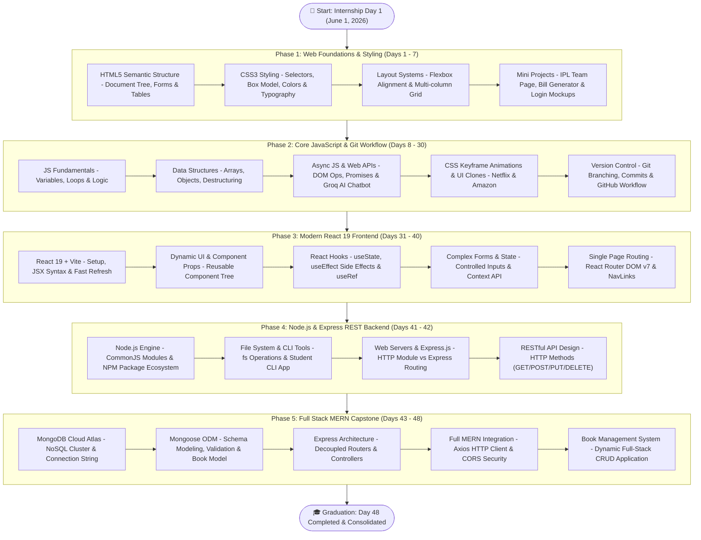
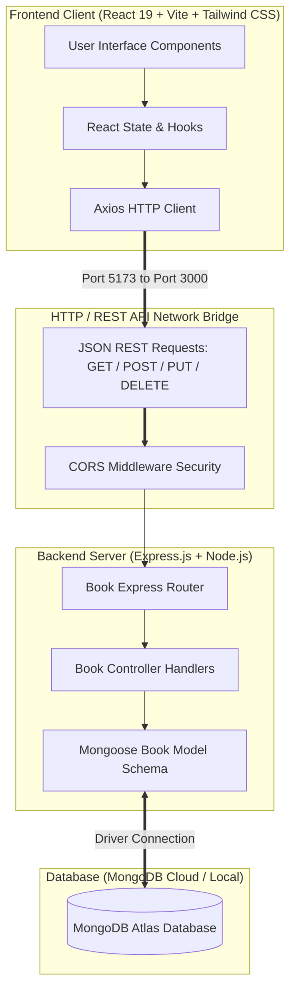
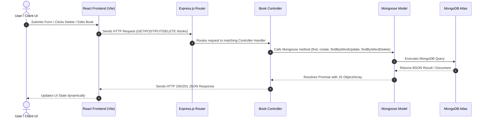

# 🚀 Internship — MERN Stack Daily Practice & Capstone Project

<div align="center">


</div>

---

## 📌 Overview & Executive Summary

Welcome to the official repository for the **MERN Stack Development Internship** (1 June 2026 – 31 August 2026). 

This repository documents the daily learning journey, hands-on practice, code drills, and full-stack projects built over **48 intensive days**. The curriculum follows a progressive pedagogical path starting from core web standards (HTML5, CSS3, ES6+ JavaScript), transitioning into modern frontend architecture (**React 19 + Vite**), backend microservices (**Node.js & Express.js**), database design (**MongoDB & Mongoose**), and concluding with a full-stack **Book Management System Capstone Application**.

> 💡 **Repository Highlights:**
> - **48 Daily Practice Log Entries** preserved with precise folder links and key deliverables.
> - **40 Subdirectories** containing vanilla JS apps, CSS clones, React components, and Node API servers.
> - **1 Consolidated Full-Stack MERN Capstone** (`Book-Management-System/`) featuring full CRUD capabilities, REST API architecture, Axios integration, and CORS handling.

---

## 📊 Visual Diagrams, Flowcharts & Architecture Graphs

### 1. Learning Path & Skill Evolution Flowchart

The following diagram illustrates the progressive skill acquisition path throughout the internship:


```mermaid
flowchart TD
    Start(["🚀 Start: Internship Day 1 (June 1, 2026)"]) --> Phase1

    subgraph Phase1["Phase 1: Web Foundations & Styling (Days 1 - 7)"]
        P1A["HTML5 Semantic Structure - Document Tree, Forms & Tables"]
        P1B["CSS3 Styling - Selectors, Box Model, Colors & Typography"]
        P1C["Layout Systems - Flexbox Alignment & Multi-column Grid"]
        P1D["Mini Projects - IPL Team Page, Bill Generator & Login Mockups"]
        P1A --> P1B --> P1C --> P1D
    end

    Phase1 --> Phase2

    subgraph Phase2["Phase 2: Core JavaScript & Git Workflow (Days 8 - 30)"]
        P2A["JS Fundamentals - Variables, Loops & Logic"]
        P2B["Data Structures - Arrays, Objects, Destructuring"]
        P2C["Async JS & Web APIs - DOM Ops, Promises & Groq AI Chatbot"]
        P2D["CSS Keyframe Animations & UI Clones - Netflix & Amazon"]
        P2E["Version Control - Git Branching, Commits & GitHub Workflow"]
        P2A --> P2B --> P2C --> P2D --> P2E
    end

    Phase2 --> Phase3

    subgraph Phase3["Phase 3: Modern React 19 Frontend (Days 31 - 40)"]
        P3A["React 19 + Vite - Setup, JSX Syntax & Fast Refresh"]
        P3B["Dynamic UI & Component Props - Reusable Component Tree"]
        P3C["React Hooks - useState, useEffect Side Effects & useRef"]
        P3D["Complex Forms & State - Controlled Inputs & Context API"]
        P3E["Single Page Routing - React Router DOM v7 & NavLinks"]
        P3A --> P3B --> P3C --> P3D --> P3E
    end

    Phase3 --> Phase4

    subgraph Phase4["Phase 4: Node.js & Express REST Backend (Days 41 - 42)"]
        P4A["Node.js Engine - CommonJS Modules & NPM Package Ecosystem"]
        P4B["File System & CLI Tools - fs Operations & Student CLI App"]
        P4C["Web Servers & Express.js - HTTP Module vs Express Routing"]
        P4D["RESTful API Design - HTTP Methods (GET/POST/PUT/DELETE)"]
        P4A --> P4B --> P4C --> P4D
    end

    Phase4 --> Phase5

    subgraph Phase5["Phase 5: Full Stack MERN Capstone (Days 43 - 48)"]
        P5A["MongoDB Cloud Atlas - NoSQL Cluster & Connection String"]
        P5B["Mongoose ODM - Schema Modeling, Validation & Book Model"]
        P5C["Express Architecture - Decoupled Routers & Controllers"]
        P5D["Full MERN Integration - Axios HTTP Client & CORS Security"]
        P5E["Book Management System - Dynamic Full-Stack CRUD Application"]
        P5A --> P5B --> P5C --> P5D --> P5E
    end

    Phase5 --> End(["🎓 Graduation: Day 48 Completed & Consolidated"])
```

### 2. Full Stack MERN System Architecture

The capstone project implements a decoupled architecture connecting a modern React client to an Express REST backend backed by MongoDB Atlas.


```mermaid
flowchart TB
    subgraph ClientLayer["Frontend Client (React 19 + Vite + Tailwind CSS)"]
        UI[User Interface Components]
        State[React State & Hooks]
        AxiosClient[Axios HTTP Client]
        UI --> State
        State --> AxiosClient
    end

    subgraph TransportLayer["HTTP / REST API Network Bridge"]
        Req[JSON REST Requests: GET / POST / PUT / DELETE]
        CORS[CORS Middleware Security]
        AxiosClient ==>|Port 5173 to Port 3000| Req
        Req ==> CORS
    end

    subgraph ServerLayer["Backend Server (Express.js + Node.js)"]
        Router[Book Express Router]
        Controller[Book Controller Handlers]
        MongooseModel[Mongoose Book Model Schema]
        CORS --> Router
        Router --> Controller
        Controller --> MongooseModel
    end

    subgraph DatabaseLayer["Database (MongoDB Cloud / Local)"]
        AtlasDB[(MongoDB Atlas Database)]
        MongooseModel <==>|Driver Connection| AtlasDB
    end
```

### 3. API Request-Response Lifecycle Sequence Diagram


```mermaid
sequenceDiagram
    autonumber
    actor User as User / Client UI
    participant React as React Frontend (Vite)
    participant Express as Express.js Router
    participant Controller as Book Controller
    participant Schema as Mongoose Model
    participant DB as MongoDB Atlas

    User->>React: Submits Form / Clicks Delete / Edits Book
    React->>Express: Sends HTTP Request (GET/POST/PUT/DELETE /books)
    Express->>Controller: Routes request to matching Controller Handler
    Controller->>Schema: Calls Mongoose method (find, create, findByIdAndUpdate, findByIdAndDelete)
    Schema->>DB: Executes MongoDB Query
    DB-->>Schema: Returns BSON Result / Document
    Schema-->>Controller: Resolves Promise with JS Object/Array
    Controller-->>React: Sends HTTP 200/201 JSON Response
    React-->>User: Updates UI State dynamically
```

---

## 🛠️ Technology Stack & Tools Reference Table

| Layer / Category | Technology / Tool | Version / Standard | Purpose in Internship |
| :--- | :--- | :--- | :--- |
| **Frontend UI** | HTML5 / Vanilla CSS3 | Standard W3C | Core document structuring, flexbox, grid, keyframe animations |
| **Frontend Framework** | React.js | 19.x | Component-based UI building, reactive state, custom hooks |
| **Build Tooling** | Vite | Latest | Lightning-fast HMR dev server and production bundler |
| **Routing** | React Router DOM | v7 | Single Page Application (SPA) client-side navigation |
| **HTTP Client** | Axios & Fetch API | Modern ES | Asynchronous API communication between Client and Express |
| **Backend Runtime** | Node.js | v18+ | JavaScript runtime environment for backend logic and server scripts |
| **Web Framework** | Express.js | 4.x | Fast, minimalist HTTP server framework for RESTful routing |
| **Database** | MongoDB Atlas | Cloud Cluster | NoSQL document-oriented database persistence |
| **ODM Library** | Mongoose | 8.x | Schema modeling, data validation, and asynchronous query handling |
| **Middleware** | CORS / dotenv | Standard | Cross-origin resource sharing & environment variable management |
| **Version Control** | Git & GitHub | CLI | Source code tracking, branch workflows, & documentation |

---

## 📅 Detailed Day-by-Day Internship Log (Days 1 – 48)

> ⭐️ **Note:** The daily log is the core historical record of this internship. Every single day's folder, topic, and key files are preserved and categorized by learning phase.

### 🔷 Phase 1: Web Fundamentals, Layouts & HTML/CSS (Days 1 – 7)

| Day / Date | Folder Link | Focus & Topics Mastered | Key Deliverables & Files |
| :--- | :--- | :--- | :--- |
| **Day 1** <br>`06-01-2026` | [`06-01_June_Day1`](file:///c:/Users/aryan/OneDrive/Desktop/Programming/Internship/MERN%20Stack/06-01_June_Day1) | HTML & JS basics; IPL team page | `basic.js`, `index.html`, `Task1.html` |
| **Day 2** <br>`06-02-2026` | [`06-02_June_Day2`](file:///c:/Users/aryan/OneDrive/Desktop/Programming/Internship/MERN%20Stack/06-02_June_Day2) | JS variables; bill & login pages | `variable.js`, `Bill.html`, `Login.html` |
| **Day 3** <br>`06-03-2026` | [`06-03_June_Day3`](file:///c:/Users/aryan/OneDrive/Desktop/Programming/Internship/MERN%20Stack/06-03_June_Day3) | HTML markup drills (×5) | `Task1`–`Task5.html` |
| **Day 4** <br>`06-04-2026` | [`06-04_June_Day4`](file:///c:/Users/aryan/OneDrive/Desktop/Programming/Internship/MERN%20Stack/06-04_June_Day4) | HTML markup drills (×3) | `Task1`–`Task3.html` |
| **Day 5** <br>`06-05-2026` | [`06-05_June_Day5`](file:///c:/Users/aryan/OneDrive/Desktop/Programming/Internship/MERN%20Stack/06-05_June_Day5) | 20 HTML mini-tasks | `task1`–`task20.html` |
| **Day 6** <br>`06-06-2026` | [`06-06_June_Day6`](file:///c:/Users/aryan/OneDrive/Desktop/Programming/Internship/MERN%20Stack/06-06_June_Day6) | HTML lists & tables | `List-Task1/2.html`, `Table-Task3.html` |
| **Day 7** <br>`06-07-2026` | [`06-07_June_Day7`](file:///c:/Users/aryan/OneDrive/Desktop/Programming/Internship/MERN%20Stack/06-07_June_Day7) | Web page & generic task | `task.html`, `web.html` |

### 🔶 Phase 2: Core JavaScript, UI Clones & Keyframe Animations (Days 8 – 30)

| Day / Date | Folder Link | Focus & Topics Mastered | Key Deliverables & Files |
| :--- | :--- | :--- | :--- |
| **Day 8** <br>`06-08-2026` | [`06-08_June_Day8`](file:///c:/Users/aryan/OneDrive/Desktop/Programming/Internship/MERN%20Stack/06-08_June_Day8) | JS loops; login & time | `loop.js`, `login.html`, `Time.html` |
| **Day 9** <br>`06-09-2026` | [`06-09_June_Day9`](file:///c:/Users/aryan/OneDrive/Desktop/Programming/Internship/MERN%20Stack/06-09_June_Day9) | JS number / star patterns | `Pattern1`–`Pattern10.js` |
| **Day 10** <br>`06-10-2026` | [`06-10_June_Day10`](file:///c:/Users/aryan/OneDrive/Desktop/Programming/Internship/MERN%20Stack/06-10_June_Day10) | Git fundamentals (cheat sheet) | `git-cheat-sheet-education.pdf` |
| **Day 11** <br>`06-11-2026` | [`06-11_June_Day11`](file:///c:/Users/aryan/OneDrive/Desktop/Programming/Internship/MERN%20Stack/06-11_June_Day11) | Amazon Lite (clone) | `AmazonLite.html` |
| **Day 12** <br>`06-12-2026` | [`06-12_June_Day12`](file:///c:/Users/aryan/OneDrive/Desktop/Programming/Internship/MERN%20Stack/06-12_June_Day12) | DevOps homework | `devops-homework-01/` |
| **Day 13** <br>`06-13-2026` | [`06-13_June_Day13`](file:///c:/Users/aryan/OneDrive/Desktop/Programming/Internship/MERN%20Stack/06-13_June_Day13) | CSS layouts: Flipkart, profile, shapes | `flipkart.html`, `Profile.html`, `shapes.html` |
| **Day 15** <br>`06-15-2026` | [`06-15_June_Day15`](file:///c:/Users/aryan/OneDrive/Desktop/Programming/Internship/MERN%20Stack/06-15_June_Day15) | JS arrays; Todo app | `array.js`, `task.js`, `Todo.html` |
| **Day 17** <br>`06-17-2026` | [`06-17_June_Day17`](file:///c:/Users/aryan/OneDrive/Desktop/Programming/Internship/MERN%20Stack/06-17_June_Day17) | JS objects; product page | `obj.js`, `Product.html` |
| **Day 18** <br>`06-18-2026` | [`06-18_June_Day18`](file:///c:/Users/aryan/OneDrive/Desktop/Programming/Internship/MERN%20Stack/06-18_June_Day18) | Instagram (clone) | `insta.html` |
| **Day 19** <br>`06-19-2026` | [`06-19_June_Day19`](file:///c:/Users/aryan/OneDrive/Desktop/Programming/Internship/MERN%20Stack/06-19_June_Day19) | Forms | `Form.html` |
| **Day 20** <br>`06-20-2026` | [`06-20_June_Day20`](file:///c:/Users/aryan/OneDrive/Desktop/Programming/Internship/MERN%20Stack/06-20_June_Day20) | Netflix (clone) | `netflix.html` |
| **Day 22** <br>`06-22-2026` | [`06-22_June_Day22`](file:///c:/Users/aryan/OneDrive/Desktop/Programming/Internship/MERN%20Stack/06-22_June_Day22) | Login form (CSS) | `login.html` |
| **Day 23** <br>`06-23-2026` | [`06-23_June_Day23`](file:///c:/Users/aryan/OneDrive/Desktop/Programming/Internship/MERN%20Stack/06-23_June_Day23) | Search & text components | `search.html`, `Text.html` |
| **Day 24** <br>`06-24-2026` | [`06-24_June_Day24`](file:///c:/Users/aryan/OneDrive/Desktop/Programming/Internship/MERN%20Stack/06-24_June_Day24) | Traffic light (CSS) | `traffic.html` |
| **Day 27** <br>`06-27-2026` | [`06-27_June_Day27`](file:///c:/Users/aryan/OneDrive/Desktop/Programming/Internship/MERN%20Stack/06-27_June_Day27) | CSS transitions & spiral animation | `Transition.html`, `Spiral.html` |
| **Day 28** <br>`06-28-2026` | [`06-28_June_Day28`](file:///c:/Users/aryan/OneDrive/Desktop/Programming/Internship/MERN%20Stack/06-28_June_Day28) | Responsive navbar | `navbar.html` |
| **Day 29** <br>`06-29-2026` | [`06-29_June_Day29`](file:///c:/Users/aryan/OneDrive/Desktop/Programming/Internship/MERN%20Stack/06-29_June_Day29) | JS destructuring; Portfolio project | `destructured.js`, `Portfolio/` |
| **Day 30** <br>`06-30-2026` | [`06-30_June_Day30`](file:///c:/Users/aryan/OneDrive/Desktop/Programming/Internship/MERN%20Stack/06-30_June_Day30) | JS Promises | `promise.js` |

### 🔷 Phase 3: React 19 Modern Frontend Development (Days 31 – 40)

| Day / Date | Folder Link | Focus & Topics Mastered | Key Deliverables & Files |
| :--- | :--- | :--- | :--- |
| **Day 31** <br>`07-01-2026` | [`07-01_July_Day31`](file:///c:/Users/aryan/OneDrive/Desktop/Programming/Internship/MERN%20Stack/07-01_July_Day31) | First React 19 + Vite projects | `1st-project/`, `Basic-form/` |
| **Day 32** <br>`07-04-2026` | [`07-04_July_Day32`](file:///c:/Users/aryan/OneDrive/Desktop/Programming/Internship/MERN%20Stack/07-04_July_Day32) | CSS Grid layout | `grid.html` |
| **Day 33** <br>`07-07-2026` | [`07-07_July_Day33`](file:///c:/Users/aryan/OneDrive/Desktop/Programming/Internship/MERN%20Stack/07-07_July_Day33) | React Netflix clone | `Netflix-clone/` |
| **Day 34** <br>`07-08-2026` | [`07-08_July_Day34`](file:///c:/Users/aryan/OneDrive/Desktop/Programming/Internship/MERN%20Stack/07-08_July_Day34) | Props and Components practice | `Props-Cards/` |
| **Day 35** <br>`07-09-2026` | [`07-09_July_Day35`](file:///c:/Users/aryan/OneDrive/Desktop/Programming/Internship/MERN%20Stack/07-09_July_Day35) | Portfolio rebuilt as a React 19 app | `Portfolio-React/` |
| **Day 36** <br>`07-11-2026` | [`07-11_July_Day36`](file:///c:/Users/aryan/OneDrive/Desktop/Programming/Internship/MERN%20Stack/07-11_July_Day36) | HTML & CSS chess board (start position) | `index.html`, `style.css` |
| **Day 37** <br>`07-13-2026` | [`07-13_July_Day37`](file:///c:/Users/aryan/OneDrive/Desktop/Programming/Internship/MERN%20Stack/07-13_July_Day37) | React hooks practice: useEffect & useRef | `UseEffect/`, `UseRef-Demo/` |
| **Day 38** <br>`07-14-2026` | [`07-14_July_Day38`](file:///c:/Users/aryan/OneDrive/Desktop/Programming/Internship/MERN%20Stack/07-14_July_Day38) | React form & state practice | `Task-Form/`, `Context-Hook/`, `Form-handle/`, `Form-State/` |
| **Day 39** <br>`07-15-2026` | [`07-15_July_Day39`](file:///c:/Users/aryan/OneDrive/Desktop/Programming/Internship/MERN%20Stack/07-15_July_Day39) | Basic vanilla-JS chatbot (Groq API) | `index.html`, `app.js`, `config.js`, `style.css` |
| **Day 40** <br>`07-20-2026` | [`07-20_July_Day40`](file:///c:/Users/aryan/OneDrive/Desktop/Programming/Internship/MERN%20Stack/07-20_July_Day40) | React Router: navigation & routing | `Nav-routing/` (React 19 + react-router-dom v7) |

### 🔶 Phase 4: Node.js & Express Server Architecture (Days 41 – 42)

| Day / Date | Folder Link | Focus & Topics Mastered | Key Deliverables & Files |
| :--- | :--- | :--- | :--- |
| **Day 41** <br>`07-21-2026` | [`07-21_July_Day41`](file:///c:/Users/aryan/OneDrive/Desktop/Programming/Internship/MERN%20Stack/07-21_July_Day41) | Node.js modules & file system | `ClassWork/` (modules, `fs` ops), `Hw-Task/` (student CRUD CLI) |
| **Day 42** <br>`07-23-2026` | [`07-23_July_Day42`](file:///c:/Users/aryan/OneDrive/Desktop/Programming/Internship/MERN%20Stack/07-23_July_Day42) | Node.js HTTP & Express.js server | `Nodejs/` (native `http` module), `ExpressJs/` (Express + MongoDB) |

### 🔷 Phase 5: Full Stack MERN Capstone — Book Management System (Days 43 – 48)

| Day / Date | Folder Link | Focus & Topics Mastered | Key Deliverables & Files |
| :--- | :--- | :--- | :--- |
| **Day 43** <br>`07-27-2026` | [`07-27_July_Day43`](file:///c:/Users/aryan/OneDrive/Desktop/Programming/Internship/MERN%20Stack/07-27%20&%2028_July_Day43) | Book Management App (Express + MongoDB) | `Server/` (Express server, Mongoose model, MongoDB connection), empty `Client/` |
| **Day 44** <br>`07-28-2026` | [`07-28_July_Day44`](file:///c:/Users/aryan/OneDrive/Desktop/Programming/Internship/MERN%20Stack/Book-Management-System) | Express controllers & routers (teaching) — handler in `bookController.js` | `bookController.js` (request/response logic + handler), `bookRouter.js` (route definitions), `addHandler` |
| **Day 45** <br>`07-29-2026` | [`07-29_July_Day45`](file:///c:/Users/aryan/OneDrive/Desktop/Programming/Internship/MERN%20Stack/Book-Management-System) | Delete & display records handler | `controller.js` (delete & display handler logic), `deleteHandler`, `displayHandler` |
| **Day 46** <br>`08-03-2026` | [`08-03_August_Day46`](file:///c:/Users/aryan/OneDrive/Desktop/Programming/Internship/MERN%20Stack/Book-Management-System) | Book Management System - Update handler & frontend | `Server/` (updated book controllers), `Client/` (complete React frontend with full CRUD UI) |
| **Day 47** <br>`08-04-2026` | [`08-04_August_Day47`](file:///c:/Users/aryan/OneDrive/Desktop/Programming/Internship/MERN%20Stack/Book-Management-System) | Frontend-Backend connection via Axios & CORS | `Client/` (Axios instance + API calls), `Server/` (CORS middleware enabled) |
| **Day 48** <br>`08-05-2026` | [`Book-Management-System`](file:///c:/Users/aryan/OneDrive/Desktop/Programming/Internship/MERN%20Stack/Book-Management-System) | Final cleanup and simplification | Consolidated into [`Book-Management-System/`](file:///c:/Users/aryan/OneDrive/Desktop/Programming/Internship/MERN%20Stack/Book-Management-System) |

---

## 📚 Capstone Project: Book Management System

The **Book Management System** is the flagship capstone project built during Days 43 to 48, located in the [`Book-Management-System/`](file:///c:/Users/aryan/OneDrive/Desktop/Programming/Internship/MERN%20Stack/Book-Management-System) folder. It provides a complete solution for creating, retrieving, updating, and deleting book records from a database.

### 📂 Directory & Component Structure

- 📁 **`Book-Management-System/`** — Root directory for the consolidated full-stack capstone application
  - 📂 **`Server/`** — Express.js server application backing the project
    - 📂 **`controllers/`**
      - 📄 `bookController.js` — Controller methods handling GET, POST, PUT, DELETE operations
    - 📂 **`models/`**
      - 📄 `bookModel.js` — Mongoose schema definition for Book documents
    - 📂 **`routes/`**
      - 📄 `bookRouter.js` — Express Router defining endpoints for `/books`
    - 📄 `database.js` — Mongoose connection handler to MongoDB Atlas cluster
    - 📄 `index.js` — Server bootstrap, CORS middleware setup, JSON body parser
    - 📄 `package.json` — Server dependencies (`express`, `mongoose`, `cors`, `dotenv`)
    - 📄 `.env` — Server `PORT` and `MONGODB_URI` database connection string
  - 📂 **`Client/Book-management/`** — Modern React 19 + Vite + Tailwind CSS application
    - 📂 **`src/`**
      - 📄 `App.jsx` — Main component rendering Book list, Add/Edit forms, Delete triggers
      - 📄 `main.jsx` — DOM mounting point for React application
      - 📄 `index.css` — Global styles and Tailwind CSS directives
    - 📄 `package.json` — Client npm packages (`react`, `axios`, `tailwindcss`)
    - 📄 `vite.config.js` — Vite development server and production bundler settings

### Database Entity Schema (Book Document)

| Field Name | Data Type | Constraint | Description |
| :--- | :--- | :--- | :--- |
| `_id` | `ObjectId` | Auto Generated | Unique primary identifier assigned by MongoDB |
| `bookName` | `String` | Required, Trimmed | The title of the book |
| `bookAuthor` | `String` | Required, Trimmed | The author of the book |
| `bookPrice` | `Number` | Required, Min 0 | Price of the book |
| `publishDate` | `Date` | Optional | Date when the book was published |
| `createdAt` | `Date` | Auto Generated | Schema timestamp of document creation |
| `updatedAt` | `Date` | Auto Generated | Schema timestamp of last update |

### REST API Endpoints Specification

| HTTP Method | Route Endpoint | Controller Handler | Request Body / Params | Description |
| :--- | :--- | :--- | :--- | :--- |
| `GET` | `/books` | `getAllBooks` | None | Fetches all book records from MongoDB |
| `POST` | `/books` | `createBook` | `{ bookName, bookAuthor, bookPrice, publishDate }` | Creates a new book entry |
| `PUT` | `/books/:id` | `updateBook` | Params: `id`, Body: Updated Fields | Updates existing book by ID |
| `DELETE` | `/books/:id` | `deleteBook` | Params: `id` | Removes book document from database |

---

## ⚡ How to Setup & Run

### 📋 Prerequisites & Environment Requirements

| Requirement | Recommended Version | Purpose | Link / Resource |
| :--- | :--- | :--- | :--- |
| **Node.js** | `v18.0.0` or higher | JavaScript runtime environment | [Download Node.js](https://nodejs.org/) |
| **npm** | `v9.0.0` or higher | Dependency package manager | Included with Node.js |
| **MongoDB Atlas** | Cloud Cluster | NoSQL Database persistence | [MongoDB Atlas Signup](https://www.mongodb.com/atlas) |

---

### 1. 🌐 Running Static HTML & Vanilla JS Tasks (Days 1 – 30)
1. Navigate into any static task folder (e.g., `06-11_June_Day11`, `06-20_June_Day20`).
2. Open `index.html` or the respective `.html` file directly in any modern web browser.
3. **For Day 39 AI Chatbot (`07-15_July_Day39`):**
   - Add your Groq API Key to `config.js`:
     ```javascript
     window.CHATBOT_CONFIG = { groqApiKey: "YOUR_GROQ_API_KEY" };
     ```
   - Launch `index.html` in your browser.

---

### 2. ⚛️ Running Standalone React Projects (Days 31 – 40)
```bash
# Example: React Router navigation practice on Day 40
cd "07-20_July_Day40/Nav-routing"

# Install project dependencies
npm install

# Start Vite live development server
npm run dev
```
Open your browser at `http://localhost:5173`.

---

### 3. 🟢 Running Node.js CLI & Server Projects (Days 41 – 42)
```bash
# Example: Student Record CLI Application on Day 41
cd "07-21_July_Day41/ClassWork"

# Install dependencies and start with nodemon
npm install
npm start
```

---

### 4. 🚀 Running the Full-Stack MERN Capstone (`Book-Management-System`)

#### Step A: Configure & Launch Backend Server
```bash
# 1. Navigate to Server directory
cd Book-Management-System/Server

# 2. Install backend dependencies
npm install
```

Create a `.env` file inside `Book-Management-System/Server`:
```env
PORT=3000
MONGODB_URI=mongodb+srv://<username>:<password>@cluster.mongodb.net/bookstore?retryWrites=true&w=majority
DB_NAME=bookstore
```

Start the Express backend server:
```bash
npm start
```
> ℹ️ Backend API server runs on `http://localhost:3000`.

#### Step B: Configure & Launch Frontend Client
In a **new terminal window**:
```bash
# 1. Navigate to Client directory
cd Book-Management-System/Client/Book-management

# 2. Install frontend dependencies
npm install

# 3. Start Vite dev server
npm run dev
```
> 🚀 Open `http://localhost:5173` in your web browser to interact with the full MERN application!

---

## 📈 Internship Milestones & Evaluation Summary

| Milestone | Target Horizon | Technologies Mastered | Verification Status |
| :--- | :--- | :--- | :--- |
| **Milestone 1: Web Fundamentals** | Days 1 – 7 | HTML5 Semantic Tags, Forms, Tables, Selectors | ✅ Completed |
| **Milestone 2: Dynamic JS & DOM** | Days 8 – 20 | ES6+, Array/Object Methods, DOM Manipulation | ✅ Completed |
| **Milestone 3: CSS Layouts & Animation**| Days 21 – 30 | Flexbox, Grid, CSS Keyframes, UI Clones (Netflix/Amazon) | ✅ Completed |
| **Milestone 4: Modern React 19** | Days 31 – 40 | JSX, State, Props, Hooks (`useEffect`, `useRef`), React Router v7 | ✅ Completed |
| **Milestone 5: Node.js & REST APIs** | Days 41 – 42 | File System (`fs`), Express Routing, HTTP Methods, Middleware | ✅ Completed |
| **Milestone 6: MERN Capstone App** | Days 43 – 48 | Express REST API + Mongoose ODM + React 19 Frontend + Axios + CORS | ✅ Completed |

---

<div align="center">

**🎓 Internship Completed Successfully! (1 June 2026 – 31 August 2026)**  
*Maintained and Developed by Aryan Barbate*

</div>
