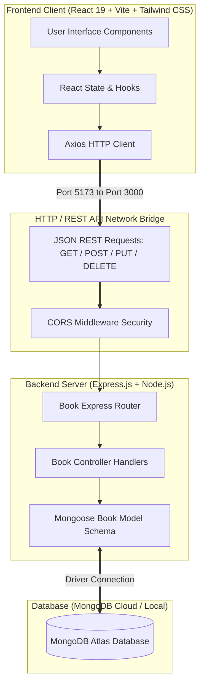
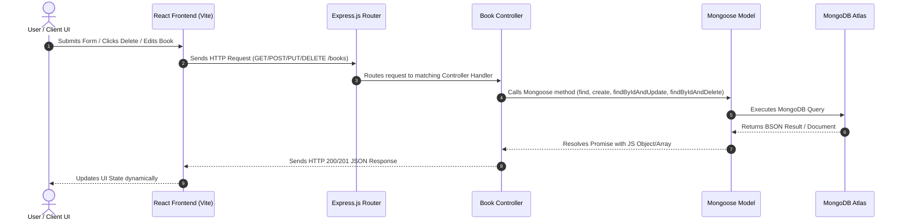
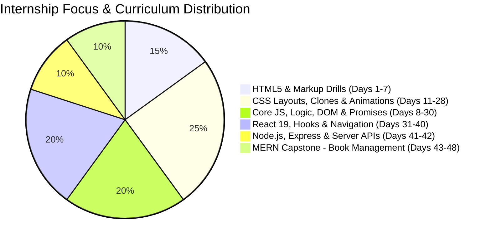

# 🚀 Internship — MERN Stack Daily Practice & Capstone Project

<div align="center">

---

## 📌 Overview & Executive Summary

Welcome to the official repository for the **MERN Stack Development Internship** (1 June 2026 – 31 August 2026).

This repository documents the daily learning journey, hands-on practice, code drills, and full-stack projects built over **48 intensive days**. The curriculum follows a progressive pedagogical path starting from core web standards (HTML5, CSS3, ES6+ JavaScript), transitioning into modern frontend architecture (**React 19 + Vite**), backend microservices (**Node.js & Express.js**), database design (**MongoDB & Mongoose**), and concluding with a full-stack **Book Management System Capstone Application**.

> 💡 **Repository Highlights:**
>
> - **48 Daily Practice Log Entries** preserved with precise folder links and key deliverables.
> - **40 Subdirectories** containing vanilla JS apps, CSS clones, React components, and Node API servers.
> - **1 Consolidated Full-Stack MERN Capstone** (`Book-Management-System/`) featuring full CRUD capabilities, REST API architecture, Axios integration, and CORS handling.

---

## 📊 Visual Diagrams, Flowcharts & Architecture Graphs

### 1. Learning Path & Skill Evolution Flowchart

The following diagram illustrates the progressive skill acquisition path throughout the internship:


```mermaid
flowchart TB
    %% Start Milestone
    Start(["🚀 Start: Internship Day 1 (June 1, 2026)"]) --> Phase1

    subgraph Phase1["🌐 Phase 1: Web Foundations & Styling (Days 1 - 7)"]
        direction TB
        P1A["📄 HTML5 Semantic Structure<br/><i>Document tree, Forms, Media, Tables</i>"]
        P1B["🎨 CSS3 Fundamentals & Styling<br/><i>Selectors, Box Model, Colors, Typography</i>"]
        P1C["📐 Layout Systems<br/><i>Flexbox Alignment, Multi-column Layouts</i>"]
        P1D["💻 Mini Projects<br/><i>IPL Team Page, Bill Generator, Login Mockups</i>"]
        
        P1A --> P1B --> P1C --> P1D
    end

    Phase1 ==> Phase2

    subgraph Phase2["⚡ Phase 2: Core JavaScript & Git Workflow (Days 8 - 30)"]
        direction TB
        P2A["🧠 JavaScript Fundamentals<br/><i>Variables (let/const), Datatypes, Loops & Logic</i>"]
        P2B["🧮 Data Structures & Algorithms<br/><i>Arrays, Objects, Destructuring, Pattern Drills</i>"]
        P2C["⚡ Asynchronous JS & Web APIs<br/><i>DOM Manipulation, Promises, async/await, Groq AI Integration</i>"]
        P2D["🌀 Animations & UI Clones<br/><i>CSS Keyframes, Transitions, Netflix & Amazon Clones</i>"]
        P2E["🐙 Version Control<br/><i>Git Repositories, Branching, Commits & GitHub</i>"]

        P2A --> P2B --> P2C --> P2D --> P2E
    end

    Phase2 ==> Phase3

    subgraph Phase3["⚛️ Phase 3: Modern React 19 Frontend (Days 31 - 40)"]
        direction TB
        P3A["⚡ React 19 + Vite Setup<br/><i>JSX Syntax, Component Architecture, Fast Refresh</i>"]
        P3B["🔄 Dynamic UI & Props<br/><i>Reusable Components, Prop Passing & Destructuring</i>"]
        P3C["🎣 React Hooks Mastery<br/><i>useState, useEffect Side Effects, useRef DOM References</i>"]
        P3D["📑 Complex Forms & State<br/><i>Controlled Components, Form Handling, Context API</i>"]
        P3E["🧭 Single Page Routing<br/><i>React Router DOM v7, Layout Routes & NavLinks</i>"]

        P3A --> P3B --> P3C --> P3D --> P3E
    end

    Phase3 ==> Phase4

    subgraph Phase4["🖥️ Phase 4: Node.js & Express REST Backend (Days 41 - 42)"]
        direction TB
        P4A["🟢 Node.js Runtime Engine<br/><i>Global Objects, CommonJS Modules, NPM Packages</i>"]
        P4B["📁 File System & CLI Tools<br/><i>fs Module Ops, Student Record CLI Application</i>"]
        P4C["🌐 Web Servers & Express.js<br/><i>Native http vs Express Framework, Middleware Pipeline</i>"]
        P4D["🛣️ RESTful API Routing<br/><i>HTTP Methods (GET, POST, PUT, DELETE), Route Params</i>"]

        P4A --> P4B --> P4C --> P4D
    end

    Phase4 ==> Phase5

    subgraph Phase5["🏆 Phase 5: Full Stack MERN Capstone (Days 43 - 48)"]
        direction TB
        P5A["🍃 MongoDB Cloud Atlas<br/><i>NoSQL Document Store, Network Access & Cluster Config</i>"]
        P5B["📦 Mongoose ODM Schemas<br/><i>Document Modeling, Data Validation, Book Schema</i>"]
        P5C["🧩 Express Routers & Controllers<br/><i>Decoupled bookController.js & bookRouter.js</i>"]
        P5D["🔄 Client-Backend Bridge<br/><i>Axios HTTP Instance, CORS Middleware & Error Handling</i>"]
        P5E["✨ Full MERN Book Management System<br/><i>Complete Dynamic CRUD Application with React UI</i>"]

        P5A --> P5B --> P5C --> P5D --> P5E
    end

    Phase5 ==> End(["🎓 Graduation: Day 48 Completed & Refactored"])

    %% Custom Styling
    style Start fill:#2196F3,stroke:#1565C0,stroke-width:2px,color:#fff,font-weight:bold
    style Phase1 fill:#E3F2FD,stroke:#90CAF9,stroke-width:2px,color:#0D47A1
    style Phase2 fill:#FFF3E0,stroke:#FFCC80,stroke-width:2px,color:#E65100
    style Phase3 fill:#E0F7FA,stroke:#80DEEA,stroke-width:2px,color:#006064
    style Phase4 fill:#E8F5E9,stroke:#A5D6A7,stroke-width:2px,color:#1B5E20
    style Phase5 fill:#F3E5F5,stroke:#CE93D8,stroke-width:2px,color:#4A148C
    style End fill:#4CAF50,stroke:#2E7D32,stroke-width:3px,color:#fff,font-weight:bold
```

### 2. Full Stack MERN System Architecture

The capstone project implements a decoupled architecture connecting a modern React client to an Express REST backend backed by MongoDB Atlas.


```mermaid
flowchart TB
    subgraph ClientLayer["Frontend Client (React 19 + Vite + Tailwind CSS)"]
        UI[User Interface Components]
        State[React State & Hooks]
        AxiosClient[Axios HTTP Client]
        UI --> State
        State --> AxiosClient
    end

    subgraph TransportLayer["HTTP / REST API Network Bridge"]
        Req[JSON REST Requests: GET / POST / PUT / DELETE]
        CORS[CORS Middleware Security]
        AxiosClient ==>|Port 5173 to Port 3000| Req
        Req ==> CORS
    end

    subgraph ServerLayer["Backend Server (Express.js + Node.js)"]
        Router[Book Express Router]
        Controller[Book Controller Handlers]
        MongooseModel[Mongoose Book Model Schema]
        CORS --> Router
        Router --> Controller
        Controller --> MongooseModel
    end

    subgraph DatabaseLayer["Database (MongoDB Cloud / Local)"]
        AtlasDB[(MongoDB Atlas Database)]
        MongooseModel <==>|Driver Connection| AtlasDB
    end
```

### 3. API Request-Response Lifecycle Sequence Diagram


```mermaid
sequenceDiagram
    autonumber
    actor User as User / Client UI
    participant React as React Frontend (Vite)
    participant Express as Express.js Router
    participant Controller as Book Controller
    participant Schema as Mongoose Model
    participant DB as MongoDB Atlas

    User->>React: Submits Form / Clicks Delete / Edits Book
    React->>Express: Sends HTTP Request (GET/POST/PUT/DELETE /books)
    Express->>Controller: Routes request to matching Controller Handler
    Controller->>Schema: Calls Mongoose method (find, create, findByIdAndUpdate, findByIdAndDelete)
    Schema->>DB: Executes MongoDB Query
    DB-->>Schema: Returns BSON Result / Document
    Schema-->>Controller: Resolves Promise with JS Object/Array
    Controller-->>React: Sends HTTP 200/201 JSON Response
    React-->>User: Updates UI State dynamically
```

### 4. Internship Curriculum & Time Distribution Graph


```mermaid
pie title Internship Focus & Curriculum Distribution
    "HTML5 & Markup Drills (Days 1-7)" : 15
    "CSS Layouts, Clones & Animations (Days 11-28)" : 25
    "Core JS, Logic, DOM & Promises (Days 8-30)" : 20
    "React 19, Hooks & Navigation (Days 31-40)" : 20
    "Node.js, Express & Server APIs (Days 41-42)" : 10
    "MERN Capstone - Book Management (Days 43-48)" : 10
```

---

## 🛠️ Technology Stack & Tools Reference Table

| Layer / Category             | Technology / Tool    | Version / Standard | Purpose in Internship                                               |
| :--------------------------- | :------------------- | :----------------- | :------------------------------------------------------------------ |
| **Frontend UI**        | HTML5 / Vanilla CSS3 | Standard W3C       | Core document structuring, flexbox, grid, keyframe animations       |
| **Frontend Framework** | React.js             | 19.x               | Component-based UI building, reactive state, custom hooks           |
| **Build Tooling**      | Vite                 | Latest             | Lightning-fast HMR dev server and production bundler                |
| **Routing**            | React Router DOM     | v7                 | Single Page Application (SPA) client-side navigation                |
| **HTTP Client**        | Axios & Fetch API    | Modern ES          | Asynchronous API communication between Client and Express           |
| **Backend Runtime**    | Node.js              | v18+               | JavaScript runtime environment for backend logic and server scripts |
| **Web Framework**      | Express.js           | 4.x                | Fast, minimalist HTTP server framework for RESTful routing          |
| **Database**           | MongoDB Atlas        | Cloud Cluster      | NoSQL document-oriented database persistence                        |
| **ODM Library**        | Mongoose             | 8.x                | Schema modeling, data validation, and asynchronous query handling   |
| **Middleware**         | CORS / dotenv        | Standard           | Cross-origin resource sharing & environment variable management     |
| **Version Control**    | Git & GitHub         | CLI                | Source code tracking, branch workflows, & documentation             |

---

## 📅 Detailed Day-by-Day Internship Log (Days 1 – 48)

> ⭐️ **Note:** The daily log is the core historical record of this internship. Every single day's folder, topic, and key files are preserved and categorized by learning phase.

### 🔷 Phase 1: Web Fundamentals, Layouts & HTML/CSS (Days 1 – 7)

| Day / Date                     | Folder Link                                                                                                         | Focus & Topics Mastered          | Key Deliverables & Files                       |
| :----------------------------- | :------------------------------------------------------------------------------------------------------------------ | :------------------------------- | :--------------------------------------------- |
| **Day 1** `06-01-2026` | [`06-01_June_Day1`](<file:///c:/Users/aryan/OneDrive/Desktop/Programming/Internship/MERN%20Stack/06-01_June_Day1>) | HTML & JS basics; IPL team page  | `basic.js`, `index.html`, `Task1.html`   |
| **Day 2** `06-02-2026` | [`06-02_June_Day2`](<file:///c:/Users/aryan/OneDrive/Desktop/Programming/Internship/MERN%20Stack/06-02_June_Day2>) | JS variables; bill & login pages | `variable.js`, `Bill.html`, `Login.html` |
| **Day 3** `06-03-2026` | [`06-03_June_Day3`](<file:///c:/Users/aryan/OneDrive/Desktop/Programming/Internship/MERN%20Stack/06-03_June_Day3>) | HTML markup drills (×5)         | `Task1`–`Task5.html`                      |
| **Day 4** `06-04-2026` | [`06-04_June_Day4`](<file:///c:/Users/aryan/OneDrive/Desktop/Programming/Internship/MERN%20Stack/06-04_June_Day4>) | HTML markup drills (×3)         | `Task1`–`Task3.html`                      |
| **Day 5** `06-05-2026` | [`06-05_June_Day5`](<file:///c:/Users/aryan/OneDrive/Desktop/Programming/Internship/MERN%20Stack/06-05_June_Day5>) | 20 HTML mini-tasks               | `task1`–`task20.html`                     |
| **Day 6** `06-06-2026` | [`06-06_June_Day6`](<file:///c:/Users/aryan/OneDrive/Desktop/Programming/Internship/MERN%20Stack/06-06_June_Day6>) | HTML lists & tables              | `List-Task1/2.html`, `Table-Task3.html`    |
| **Day 7** `06-07-2026` | [`06-07_June_Day7`](<file:///c:/Users/aryan/OneDrive/Desktop/Programming/Internship/MERN%20Stack/06-07_June_Day7>) | Web page & generic task          | `task.html`, `web.html`                    |

### 🔶 Phase 2: Core JavaScript, UI Clones & Keyframe Animations (Days 8 – 30)

| Day / Date                      | Folder Link                                                                                                           | Focus & Topics Mastered                | Key Deliverables & Files                             |
| :------------------------------ | :-------------------------------------------------------------------------------------------------------------------- | :------------------------------------- | :--------------------------------------------------- |
| **Day 8** `06-08-2026`  | [`06-08_June_Day8`](<file:///c:/Users/aryan/OneDrive/Desktop/Programming/Internship/MERN%20Stack/06-08_June_Day8>)   | JS loops; login & time                 | `loop.js`, `login.html`, `Time.html`           |
| **Day 9** `06-09-2026`  | [`06-09_June_Day9`](<file:///c:/Users/aryan/OneDrive/Desktop/Programming/Internship/MERN%20Stack/06-09_June_Day9>)   | JS number / star patterns              | `Pattern1`–`Pattern10.js`                       |
| **Day 10** `06-10-2026` | [`06-10_June_Day10`](<file:///c:/Users/aryan/OneDrive/Desktop/Programming/Internship/MERN%20Stack/06-10_June_Day10>) | Git fundamentals (cheat sheet)         | `git-cheat-sheet-education.pdf`                    |
| **Day 11** `06-11-2026` | [`06-11_June_Day11`](<file:///c:/Users/aryan/OneDrive/Desktop/Programming/Internship/MERN%20Stack/06-11_June_Day11>) | Amazon Lite (clone)                    | `AmazonLite.html`                                  |
| **Day 12** `06-12-2026` | [`06-12_June_Day12`](<file:///c:/Users/aryan/OneDrive/Desktop/Programming/Internship/MERN%20Stack/06-12_June_Day12>) | DevOps homework                        | `devops-homework-01/`                              |
| **Day 13** `06-13-2026` | [`06-13_June_Day13`](<file:///c:/Users/aryan/OneDrive/Desktop/Programming/Internship/MERN%20Stack/06-13_June_Day13>) | CSS layouts: Flipkart, profile, shapes | `flipkart.html`, `Profile.html`, `shapes.html` |
| **Day 15** `06-15-2026` | [`06-15_June_Day15`](<file:///c:/Users/aryan/OneDrive/Desktop/Programming/Internship/MERN%20Stack/06-15_June_Day15>) | JS arrays; Todo app                    | `array.js`, `task.js`, `Todo.html`             |
| **Day 17** `06-17-2026` | [`06-17_June_Day17`](<file:///c:/Users/aryan/OneDrive/Desktop/Programming/Internship/MERN%20Stack/06-17_June_Day17>) | JS objects; product page               | `obj.js`, `Product.html`                         |
| **Day 18** `06-18-2026` | [`06-18_June_Day18`](<file:///c:/Users/aryan/OneDrive/Desktop/Programming/Internship/MERN%20Stack/06-18_June_Day18>) | Instagram (clone)                      | `insta.html`                                       |
| **Day 19** `06-19-2026` | [`06-19_June_Day19`](<file:///c:/Users/aryan/OneDrive/Desktop/Programming/Internship/MERN%20Stack/06-19_June_Day19>) | Forms                                  | `Form.html`                                        |
| **Day 20** `06-20-2026` | [`06-20_June_Day20`](<file:///c:/Users/aryan/OneDrive/Desktop/Programming/Internship/MERN%20Stack/06-20_June_Day20>) | Netflix (clone)                        | `netflix.html`                                     |
| **Day 22** `06-22-2026` | [`06-22_June_Day22`](<file:///c:/Users/aryan/OneDrive/Desktop/Programming/Internship/MERN%20Stack/06-22_June_Day22>) | Login form (CSS)                       | `login.html`                                       |
| **Day 23** `06-23-2026` | [`06-23_June_Day23`](<file:///c:/Users/aryan/OneDrive/Desktop/Programming/Internship/MERN%20Stack/06-23_June_Day23>) | Search & text components               | `search.html`, `Text.html`                       |
| **Day 24** `06-24-2026` | [`06-24_June_Day24`](<file:///c:/Users/aryan/OneDrive/Desktop/Programming/Internship/MERN%20Stack/06-24_June_Day24>) | Traffic light (CSS)                    | `traffic.html`                                     |
| **Day 27** `06-27-2026` | [`06-27_June_Day27`](<file:///c:/Users/aryan/OneDrive/Desktop/Programming/Internship/MERN%20Stack/06-27_June_Day27>) | CSS transitions & spiral animation     | `Transition.html`, `Spiral.html`                 |
| **Day 28** `06-28-2026` | [`06-28_June_Day28`](<file:///c:/Users/aryan/OneDrive/Desktop/Programming/Internship/MERN%20Stack/06-28_June_Day28>) | Responsive navbar                      | `navbar.html`                                      |
| **Day 29** `06-29-2026` | [`06-29_June_Day29`](<file:///c:/Users/aryan/OneDrive/Desktop/Programming/Internship/MERN%20Stack/06-29_June_Day29>) | JS destructuring; Portfolio project    | `destructured.js`, `Portfolio/`                  |
| **Day 30** `06-30-2026` | [`06-30_June_Day30`](<file:///c:/Users/aryan/OneDrive/Desktop/Programming/Internship/MERN%20Stack/06-30_June_Day30>) | JS Promises                            | `promise.js`                                       |

### 🔷 Phase 3: React 19 Modern Frontend Development (Days 31 – 40)

| Day / Date                      | Folder Link                                                                                                           | Focus & Topics Mastered                  | Key Deliverables & Files                                             |
| :------------------------------ | :-------------------------------------------------------------------------------------------------------------------- | :--------------------------------------- | :------------------------------------------------------------------- |
| **Day 31** `07-01-2026` | [`07-01_July_Day31`](<file:///c:/Users/aryan/OneDrive/Desktop/Programming/Internship/MERN%20Stack/07-01_July_Day31>) | First React 19 + Vite projects           | `1st-project/`, `Basic-form/`                                    |
| **Day 32** `07-04-2026` | [`07-04_July_Day32`](<file:///c:/Users/aryan/OneDrive/Desktop/Programming/Internship/MERN%20Stack/07-04_July_Day32>) | CSS Grid layout                          | `grid.html`                                                        |
| **Day 33** `07-07-2026` | [`07-07_July_Day33`](<file:///c:/Users/aryan/OneDrive/Desktop/Programming/Internship/MERN%20Stack/07-07_July_Day33>) | React Netflix clone                      | `Netflix-clone/`                                                   |
| **Day 34** `07-08-2026` | [`07-08_July_Day34`](<file:///c:/Users/aryan/OneDrive/Desktop/Programming/Internship/MERN%20Stack/07-08_July_Day34>) | Props and Components practice            | `Props-Cards/`                                                     |
| **Day 35** `07-09-2026` | [`07-09_July_Day35`](<file:///c:/Users/aryan/OneDrive/Desktop/Programming/Internship/MERN%20Stack/07-09_July_Day35>) | Portfolio rebuilt as a React 19 app      | `Portfolio-React/`                                                 |
| **Day 36** `07-11-2026` | [`07-11_July_Day36`](<file:///c:/Users/aryan/OneDrive/Desktop/Programming/Internship/MERN%20Stack/07-11_July_Day36>) | HTML & CSS chess board (start position)  | `index.html`, `style.css`                                        |
| **Day 37** `07-13-2026` | [`07-13_July_Day37`](<file:///c:/Users/aryan/OneDrive/Desktop/Programming/Internship/MERN%20Stack/07-13_July_Day37>) | React hooks practice: useEffect & useRef | `UseEffect/`, `UseRef-Demo/`                                     |
| **Day 38** `07-14-2026` | [`07-14_July_Day38`](<file:///c:/Users/aryan/OneDrive/Desktop/Programming/Internship/MERN%20Stack/07-14_July_Day38>) | React form & state practice              | `Task-Form/`, `Context-Hook/`, `Form-handle/`, `Form-State/` |
| **Day 39** `07-15-2026` | [`07-15_July_Day39`](<file:///c:/Users/aryan/OneDrive/Desktop/Programming/Internship/MERN%20Stack/07-15_July_Day39>) | Basic vanilla-JS chatbot (Groq API)      | `index.html`, `app.js`, `config.js`, `style.css`             |
| **Day 40** `07-20-2026` | [`07-20_July_Day40`](<file:///c:/Users/aryan/OneDrive/Desktop/Programming/Internship/MERN%20Stack/07-20_July_Day40>) | React Router: navigation & routing       | `Nav-routing/` (React 19 + react-router-dom v7)                    |

### 🔶 Phase 4: Node.js & Express Server Architecture (Days 41 – 42)

| Day / Date                      | Folder Link                                                                                                           | Focus & Topics Mastered          | Key Deliverables & Files                                                 |
| :------------------------------ | :-------------------------------------------------------------------------------------------------------------------- | :------------------------------- | :----------------------------------------------------------------------- |
| **Day 41** `07-21-2026` | [`07-21_July_Day41`](<file:///c:/Users/aryan/OneDrive/Desktop/Programming/Internship/MERN%20Stack/07-21_July_Day41>) | Node.js modules & file system    | `ClassWork/` (modules, `fs` ops), `Hw-Task/` (student CRUD CLI)    |
| **Day 42** `07-23-2026` | [`07-23_July_Day42`](<file:///c:/Users/aryan/OneDrive/Desktop/Programming/Internship/MERN%20Stack/07-23_July_Day42>) | Node.js HTTP & Express.js server | `Nodejs/` (native `http` module), `ExpressJs/` (Express + MongoDB) |

### 🔷 Phase 5: Full Stack MERN Capstone — Book Management System (Days 43 – 48)

| Day / Date                      | Folder Link                                                                                                                       | Focus & Topics Mastered                                                     | Key Deliverables & Files                                                                                                                            |
| :------------------------------ | :-------------------------------------------------------------------------------------------------------------------------------- | :-------------------------------------------------------------------------- | :-------------------------------------------------------------------------------------------------------------------------------------------------- |
| **Day 43** `07-27-2026` | [`07-27_July_Day43`](<file:///c:/Users/aryan/OneDrive/Desktop/Programming/Internship/MERN%20Stack/07-27%20&%2028_July_Day43>)    | Book Management App (Express + MongoDB)                                     | `Server/` (Express server, Mongoose model, MongoDB connection), empty `Client/`                                                                 |
| **Day 44** `07-28-2026` | [`07-28_July_Day44`](<file:///c:/Users/aryan/OneDrive/Desktop/Programming/Internship/MERN%20Stack/Book-Management-System>)       | Express controllers & routers (teaching) — handler in`bookController.js` | `bookController.js` (request/response logic + handler), `bookRouter.js` (route definitions), `addHandler`                                     |
| **Day 45** `07-29-2026` | [`07-29_July_Day45`](<file:///c:/Users/aryan/OneDrive/Desktop/Programming/Internship/MERN%20Stack/Book-Management-System>)       | Delete & display records handler                                            | `controller.js` (delete & display handler logic), `deleteHandler`, `displayHandler`                                                           |
| **Day 46** `08-03-2026` | [`08-03_August_Day46`](<file:///c:/Users/aryan/OneDrive/Desktop/Programming/Internship/MERN%20Stack/Book-Management-System>)     | Book Management System - Update handler & frontend                          | `Server/` (updated book controllers), `Client/` (complete React frontend with full CRUD UI)                                                     |
| **Day 47** `08-04-2026` | [`08-04_August_Day47`](<file:///c:/Users/aryan/OneDrive/Desktop/Programming/Internship/MERN%20Stack/Book-Management-System>)     | Frontend-Backend connection via Axios & CORS                                | `Client/` (Axios instance + API calls), `Server/` (CORS middleware enabled)                                                                     |
| **Day 48** `08-05-2026` | [`Book-Management-System`](<file:///c:/Users/aryan/OneDrive/Desktop/Programming/Internship/MERN%20Stack/Book-Management-System>) | Final cleanup and simplification                                            | Consolidated into[`Book-Management-System/`](<file:///c:/Users/aryan/OneDrive/Desktop/Programming/Internship/MERN%20Stack/Book-Management-System>) |

---

## 📚 Capstone Project: Book Management System

The **Book Management System** is the flagship capstone project built during Days 43 to 48, located in the [`Book-Management-System/`](<file:///c:/Users/aryan/OneDrive/Desktop/Programming/Internship/MERN%20Stack/Book-Management-System>) folder. It provides a complete solution for creating, retrieving, updating, and deleting book records from a database.

```
Book-Management-System/
├── Server/                      # Express.js API Server
│   ├── controllers/             # Business logic & database operations
│   │   └── bookController.js   # GET, POST, PUT, DELETE handlers
│   ├── models/                  # Database schemas
│   │   └── bookModel.js         # Mongoose Book Schema
│   ├── routes/                  # Express API Endpoints
│   │   └── bookRouter.js        # /books route mappings
│   ├── database.js              # Mongoose MongoDB Atlas connection
│   ├── index.js                 # Server entry point & CORS configuration
│   ├── package.json             # Node dependencies
│   └── .env                     # Database URI & port configuration
└── Client/                      # React Frontend Application
    └── Book-management/         # Vite + React + Tailwind CSS project
        ├── src/
        │   ├── App.jsx          # Main dynamic CRUD UI component
        │   ├── main.jsx         # React root renderer
        │   └── index.css        # Tailwind CSS styles
        ├── package.json         # Client dependencies
        └── vite.config.js       # Vite build configuration
```

### Database Entity Schema (Book Document)

| Field Name      | Data Type    | Constraint        | Description                                   |
| :-------------- | :----------- | :---------------- | :-------------------------------------------- |
| `_id`         | `ObjectId` | Auto Generated    | Unique primary identifier assigned by MongoDB |
| `bookName`    | `String`   | Required, Trimmed | The title of the book                         |
| `bookAuthor`  | `String`   | Required, Trimmed | The author of the book                        |
| `bookPrice`   | `Number`   | Required, Min 0   | Price of the book                             |
| `publishDate` | `Date`     | Optional          | Date when the book was published              |
| `createdAt`   | `Date`     | Auto Generated    | Schema timestamp of document creation         |
| `updatedAt`   | `Date`     | Auto Generated    | Schema timestamp of last update               |

### REST API Endpoints Specification

| HTTP Method | Route Endpoint | Controller Handler | Request Body / Params                                | Description                           |
| :---------- | :------------- | :----------------- | :--------------------------------------------------- | :------------------------------------ |
| `GET`     | `/books`     | `getAllBooks`    | None                                                 | Fetches all book records from MongoDB |
| `POST`    | `/books`     | `createBook`     | `{ bookName, bookAuthor, bookPrice, publishDate }` | Creates a new book entry              |
| `PUT`     | `/books/:id` | `updateBook`     | Params:`id`, Body: Updated Fields                  | Updates existing book by ID           |
| `DELETE`  | `/books/:id` | `deleteBook`     | Params:`id`                                        | Removes book document from database   |

---

## ⚡ How to Setup & Run

### Prerequisites

- [Node.js](https://nodejs.org/) (v18.0.0 or higher recommended)
- `npm` (v9.0.0 or higher)
- Free [MongoDB Atlas](https://www.mongodb.com/atlas) Cluster or local MongoDB instance

---

### 1. Running Static HTML & Vanilla JS Tasks (Days 1 – 30)

1. Navigate into any static task folder (e.g., `06-11_June_Day11`, `06-20_June_Day20`).
2. Open `index.html` or the respective `.html` file directly in any modern web browser.
3. For **Day 39 Chatbot** (`07-15_July_Day39`):
   - Add your Groq API Key to `config.js`:
     ```javascript
     window.CHATBOT_CONFIG = { groqApiKey: "YOUR_GROQ_API_KEY" };
     ```
   - Launch `index.html` in browser.

---

### 2. Running Standalone React Projects (Days 31 – 40)

```bash
# Example: Nav-routing on Day 40
cd "07-20_July_Day40/Nav-routing"

# Install project dependencies
npm install

# Start Vite live development server
npm run dev
```

Access the client in your browser at `http://localhost:5173`.

---

### 3. Running Node.js CLI & Server Projects (Days 41 – 42)

```bash
# Example: Node CLI on Day 41
cd "07-21_July_Day41/ClassWork"
npm install
npm start
```

---

### 4. Running the Full-Stack MERN Capstone Project (`Book-Management-System`)

#### Step A: Configure Backend Server

```bash
cd Book-Management-System/Server

# Install server dependencies
npm install
```

Create a `.env` file inside `Book-Management-System/Server`:

```env
PORT=3000
MONGODB_URI=mongodb+srv://<username>:<password>@cluster.mongodb.net/bookstore?retryWrites=true&w=majority
DB_NAME=bookstore
```

Start the backend server:

```bash
npm start
```

The server starts on `http://localhost:3000`.

#### Step B: Configure Frontend Client

In a new terminal window:

```bash
cd Book-Management-System/Client/Book-management

# Install client dependencies
npm install

# Start Vite dev server
npm run dev
```

Open your browser at `http://localhost:5173` to interact with the full application!

---

## 📈 Internship Milestones & Evaluation Summary

| Milestone                                      | Target Horizon | Technologies Mastered                                                 | Verification Status |
| :--------------------------------------------- | :------------- | :-------------------------------------------------------------------- | :------------------ |
| **Milestone 1: Web Fundamentals**        | Days 1 – 7    | HTML5 Semantic Tags, Forms, Tables, Selectors                         | ✅ Completed        |
| **Milestone 2: Dynamic JS & DOM**        | Days 8 – 20   | ES6+, Array/Object Methods, DOM Manipulation                          | ✅ Completed        |
| **Milestone 3: CSS Layouts & Animation** | Days 21 – 30  | Flexbox, Grid, CSS Keyframes, UI Clones (Netflix/Amazon)              | ✅ Completed        |
| **Milestone 4: Modern React 19**         | Days 31 – 40  | JSX, State, Props, Hooks (`useEffect`, `useRef`), React Router v7 | ✅ Completed        |
| **Milestone 5: Node.js & REST APIs**     | Days 41 – 42  | File System (`fs`), Express Routing, HTTP Methods, Middleware       | ✅ Completed        |
| **Milestone 6: MERN Capstone App**       | Days 43 – 48  | Express REST API + Mongoose ODM + React 19 Frontend + Axios + CORS    | ✅ Completed        |

---

<div align="center">
